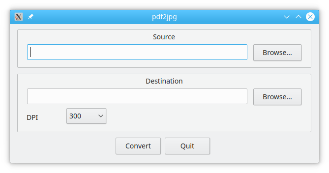

# pdf2jpg (PyQt GUI)



Minimalistic PDF to JPEG converter written in Python 3 with simple GUI.

Uses `ghostscript` to convert PDF to JPEG. 

Some day will be rewritten to `ImageMagick`.

## User's manual
* Install GhostScript & some Python tools system-wide 
(Currently Debian-way only. Please contribute to add more supported platforms.)
```bash
sudo apt install ghostscript python3-pyqt5
```
* Install pdf2jpg:
```bash
sudo mkdir /opt/pdf2jpg
sudo chown -R $USER: /opt/pdf2jpg
cd /opt/pdf2jpg
curl -O -L https://raw.githubusercontent.com/ivan-petrunko/pdf2jpg/master/pdf2jpg.py
curl -O -L https://raw.githubusercontent.com/ivan-petrunko/pdf2jpg/master/design.py
chmod +x pdf2jpg.py
sudo ln -s /opt/pdf2jpg/pdf2jpg.py /usr/local/bin/
```
* Launch application: Press `Alt + F2`, enter `pdf2jpg.py` and hit `Enter`
* Choose source PDF file
* Choose destination folder
* Set preferred DPI: 72, 144, 300, 600. Default: 300.
* Click `Convert` button
* Wait for PDF being processed. You gonna see message box when it's done.
* Have a nice day! =)

## Troubleshooting + advanced features
* If you have any problems using this app, please post a new issue.
* If you want to add some advanced features, well, pull requests are welcome =) 
Or create a new issue and I'll do it for you some day. 

## Developer's manual (contributing)
### Install QtCreator
```bash
sudo apt install pyqt5-dev-tools qtcreator
```

### Install pip & virtualenv to user-space
* Install pip:
```bash
curl https://bootstrap.pypa.io/get-pip.py -o get-pip.py
python3 get-pip.py --user
```
* Add `$HOME/.local/bin` to `$PATH` environment variable inside `.zshrc` or `.bashrc`.
* Start new terminal session, so your modified `.zshrc` or `.bashrc` will be loaded
* Install virtualenv:
```bash
pip3 install virtualenv --user
```

### Create & activate new virtualenv in project dir
Go to project directory & execute:
```bash
virtualenv -p python3 venv
source venv/bin/activate
```

### Install all requirements to virtualenv
```bash
pip install -r requirements.txt
```

### Design modification
* Open file [`pdf2jpg.ui`](pdf2jpg.ui) via QtCreator
* Modify design the way you want
* Launch Bash-script to convert [`pdf2jpg.ui`](pdf2jpg.ui) to [`design.py`](design.py)
```bash
./make_design.sh
```

### Contributing
* Fork this repo.
* Do some good things.
* Send me pull request.

## TODO
* Create installation script.
* Use ImageMagick instead of ghostscript.
* Add page range setting.
* Add output image quality selector.
* Add output image format selector: jpg, png, gif, etc.
* Add output image color setting: color, grayscale, black & white. 
* Refactor code.
* Add i18n support (internationalization).

## Appendix 1. Prehistory
Some day my wife asked me to help her convert all pages of PDF file to separate JPEG images.
Well, I've done it via Bash-command `gs`, and my wife was happy.

Next day she asked me to do the same thing to another PDF-file, and I've done it again 
(the command `gs` stored in my `HISTFILE`, so I just changed input file & output directory, 
and finished that task in 5 seconds =) ).

From that moment I've started thinking about creating simple GUI application 
so people not using Bash can do these things by themselves. 
Also, I wanted to write something in Python for a long time, and I thought that 
it is a nice coincidence. 

I've RTFM about Python's virtualenv, created it, installed QtCreator and some dependencies, 
and get ahead with design & development. Design was finished in 15 minutes =)
After that I was coding for some hours, debugged and tested app. 
I had a great mood, so I decided to write this [`README.md`](README.md) and make a public repository.

Thank you, if you've read this prehistory to the end. I wish you'll enjoy this application.

## Appendix 2. gs (ghostscript) howto
```bash
# Process specified page range
gs -dNOPAUSE -sDEVICE=jpeg -dFirstPage=1 -dLastPage=5 -sOutputFile=output%d.jpg -dJPEGQ=100 -r500 -q intput.pdf -c quit

# Process all pages with 500 dpi & 100% quality
gs -dNOPAUSE -sDEVICE=jpeg -sOutputFile=page%03d.jpg -dJPEGQ=100 -r500 -q intput.pdf -c quit
```
